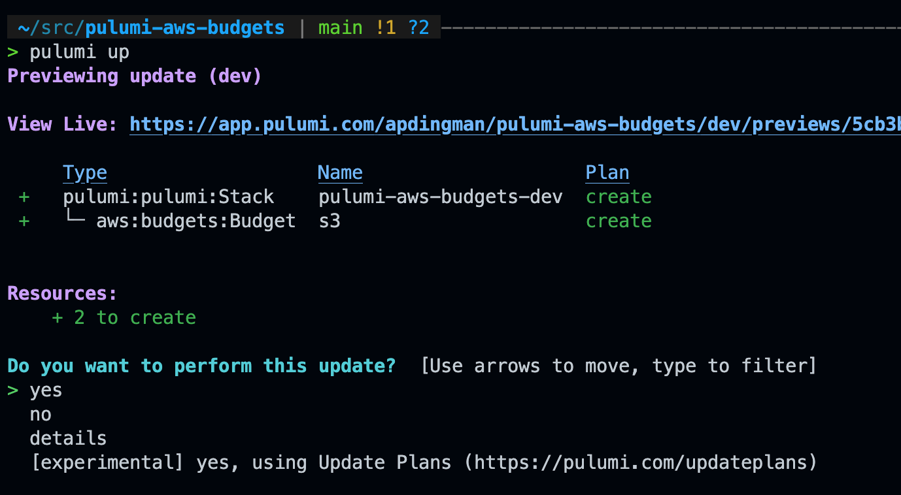
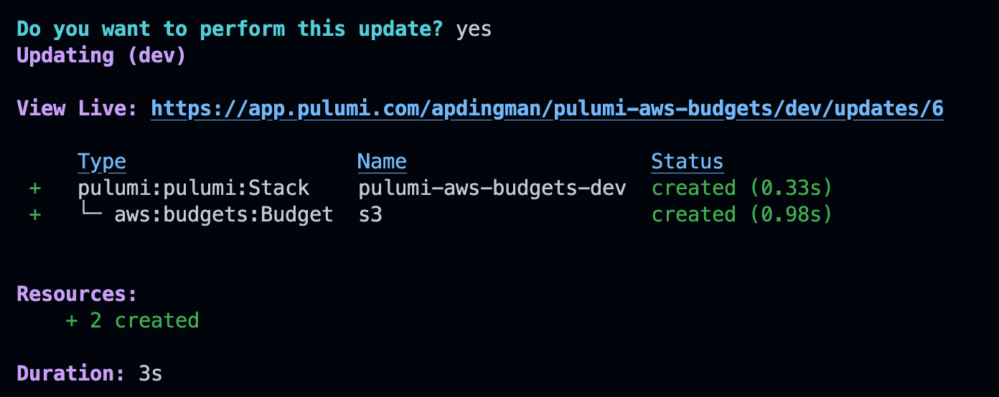
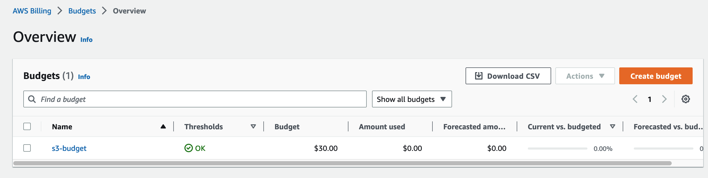
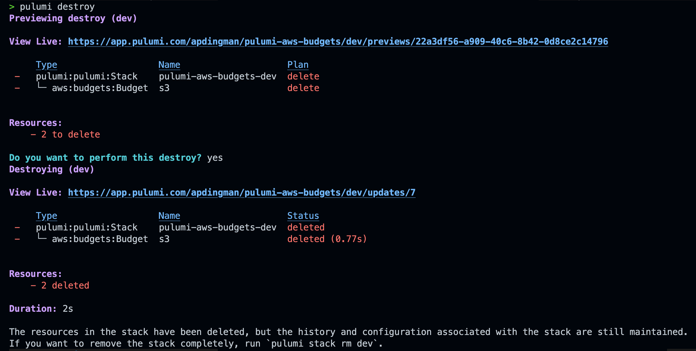

# Deploy a Budget to AWS using Pulumi
## Example
### Prerequisites

I'm performing these steps on a macOS (and you should consider adding macOS in your life too if you haven't already).

- An AWS account to deploy resources to
- [Named AWS profiles](https://docs.aws.amazon.com/cli/latest/userguide/cli-configure-profiles.html) configured on your local machine
- Homebrew installed

### Basic Steps

#### Install Pulumi

```shell
brew install pulumi
```

#### Update Pulumi Config to use the Appropriate Named AWS Profile

```shell
pulumi config set aws:profile personal
```

#### Create a Pulumi.yaml file

Create a file named `pulumi.yml` with the following content:

```yaml
name: pulumi-aws-budgets
runtime: yaml
description: A simple example of using Pulumi to deploy a budget in an AWS account
resources:
  s3:
    type: aws:budgets:Budget
    properties:
      name: s3-budget
      budgetType: COST
      costFilters:
        - name: Service
          values:
            - Amazon Simple Storage Service
      limitAmount: '30'
      limitUnit: USD
      notifications:
        - comparisonOperator: GREATER_THAN
          notificationType: ACTUAL
          subscriberEmailAddresses:
            - [youremail@domain.com]
          threshold: 100
          thresholdType: PERCENTAGE
      timeUnit: MONTHLY
```

#### Deploy your budget

Run the command:

```shell
pulumi up
```

You'll be presented with a prompt like so:



Navigate to **yes**, and press **enter**.

You'll be presented with information that shows that your *pulumi* stack and the budget included specified has been created: 



#### Verify in the AWS console

Navigate to the AWS billing service in the AWS console and confirm that your budget was created as expected:


#### Tear down

Destroying resources managed by Pulumi is super straightforward. Simply run the destroy command and confirm that you want to perform the destroy.

```shell
pulumi destroy
```

